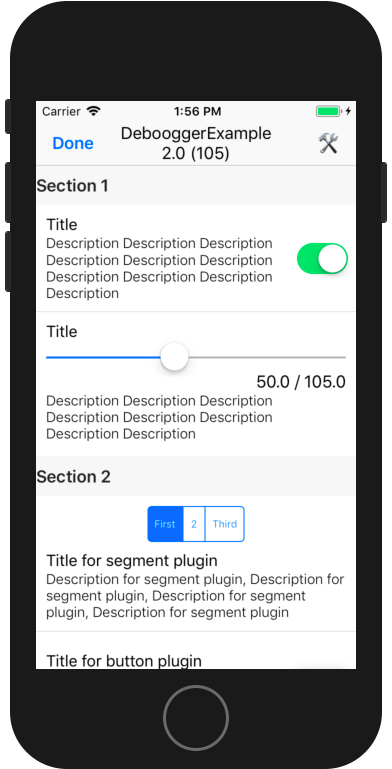

# Deboogger
Debug screen for your apps.

<p align="center">
	
</p>

## Usage

```swift
Deboogger.configure(with:
    SwitchTestPlugin(),
    SliderTestPlugin(),
    SegmentTestPlugin(),
    ButtonTestPlugin()
)

Deboogger.configure(with:
    Section(title: "Section 1", plugins: SwitchTestPlugin(), SliderTestPlugin()),
    Section(title: "Section 2", plugins: SegmentTestPlugin(), ButtonTestPlugin())
)
```

## Installation

### Carthage:
```
github "Otbivnoe/Deboogger"
```

## License

Deboogger is available under the MIT license. See the LICENSE file for more info.